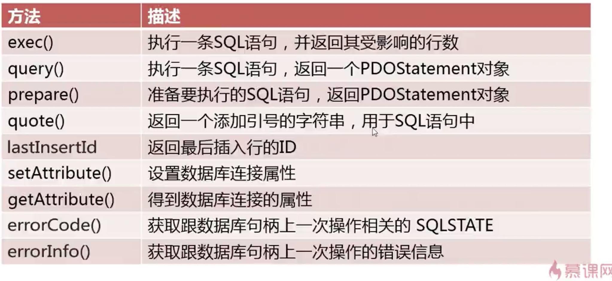

PDO(PHP Data Object)
====================

1.PDO简介
2.PDO安装与配置
3.PDO链接数据库
4.PDO对象方法介绍及使用
5.PDOStatement对象方法介绍及使用
6.PDO错误处理
7.PDO参数绑定与预处理
8.PDO事务处理
9.PDO实战


## 1.PDO简介
PDO(PHP Data Object)，数据库访问抽象层，统一各种数据库的访问接口。

### PDO特性
1.编码一致性
2.灵活性
3.高性能
4.面向对象特性


## 2.PDO安装与配置

MAMPA已开启，不作操作


## 3.PDO链接数据库
1.通过参数形式连接数据库
```
try {
    $dsn = 'mysql:host=localhost;dbname=api';
    $name = 'root';
    $pwd = 'root1';
    $pdo = new PDO($dsn, $name, $pwd);
    var_dump($pdo);
} catch (PDOException $e) {
    echo var_dump($e);
}
```
2.通过URI形式连接数据库
3.通过配置文件形式连接数据库

## 4.PDO对象方法介绍及使用

  
  

## 5.PDOStatement对象方法介绍及使用

  
  

## 6.PDO错误处理

PDO::ATTR_ERRMODE 三种模式  
 PDO::ERRMODE_EXCEPTION  
 PDO::ERRMODE_WARNING  
 PDO::ERRMODE_SILENT  


## 8.PDO事务处理

$pdo->setAttribute(PDO::ATTR_AUTOCOMMIT, 0);
$pdo->beginTransaction();
$pdo->commit();
$pdo->rollBack();

## 9.PDO实战

